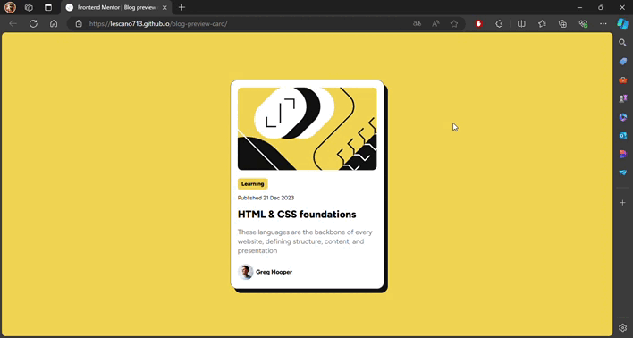

# Frontend Mentor - Blog preview card solution

<div align="left">
  <a href="https://www.linkedin.com/in/danae-lescano-salvatierra" target="_blank">
    
  </a>
  <a href="https://lescano713.github.io/blog-preview-card/" target="_blank">
    
  </a>
  <a href="https://www.frontendmentor.io/profile/Lescano713" target="_blank">
    
  </a>
</div>

## Table of contents

- [Overview](#overview)
  - [The challenge](#the-challenge)
  - [Screenshot](#screenshot)
- [My process](#my-process)
  - [Built with](#built-with)
  - [What I learned](#what-i-learned)
  - [Continued development](#continued-development)


## Overview

### The challenge

Users should be able to:

- See hover and focus states for all interactive elements on the page.
- The card is responsive to different screen sizes.

### Screenshot




## My process

### Built with

- Semantic HTML5 markup
- CSS custom properties
- Flexbox


### What I learned

<p>I learned how to use CSS custom properties (--colorBackground, --colorCard, etc.) to create a more maintainable and flexible styling system. Defining color values in one place allows for easy adjustments across the entire project. Additionally, I gained experience with @font-face to incorporate custom fonts with different weights, improving the typography of my design.</p>

```css
:root{
    --colorBackground: hsl(47, 88%, 63%);
    --colorCard: hsl(0, 0%, 100%);
    --colorParagraph: hsl(0, 0%, 50%);
    --colorTitles: hsl(0, 0%, 7%);
}
@font-face {
    font-family: 'Figtree';
    src: url('./assets/fonts/Figtree-VariableFont_wght.ttf') format('truetype');
    font-weight: normal;
}
```

<p>The hover and active states applied to .card demonstrate how to add interactive effects, such as scaling and changing box shadows, to enhance user experience.</p>


```css
.card:hover{
    transform: scale(0.9);
    cursor: pointer;
}
.card:active{
    box-shadow: -8px -9px 0 0 var(--colorTitles);
}
```


### Continued development
<p>Going forward, I plan to:</p>
<p>Improve Font Handling: Explore font formats and loading techniques to enhance performance and compatibility.
Refine Responsive Design: Ensure that the card and other components adapt seamlessly to various screen sizes and devices.
Leverage Advanced CSS Layouts: Experiment with CSS Grid for more complex and responsive layouts.
Enhance User Interactions: Continue to improve interactive elements with animations and transitions for a more dynamic user experience.</p>


